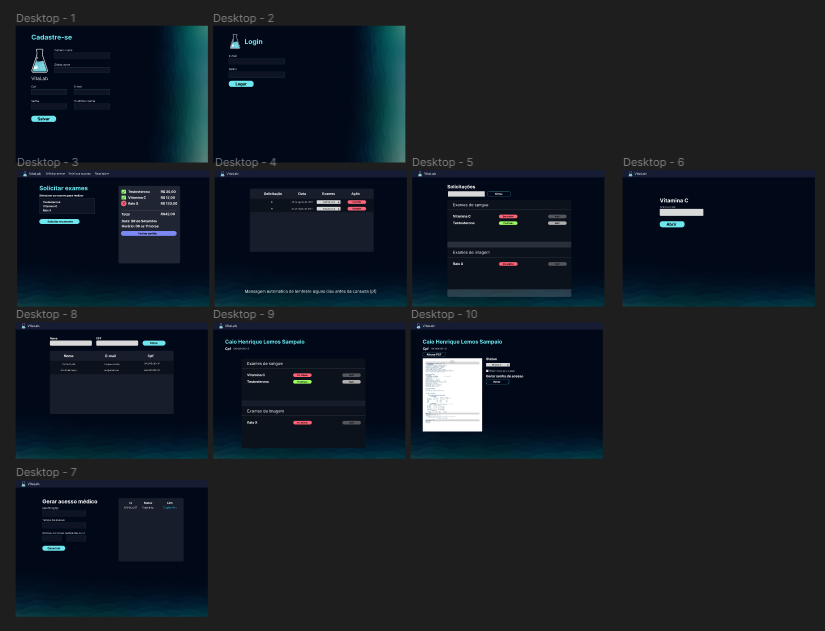

# #23 Pystack Week 8.0 - Pythonando

## Projeto de uma plataforme de laboratório 👋

Criamos em aula um projeto contendo todo o sistema de uma laboratório (Vitalab).
Foram criadas as telas:
- Cadastro / Login de usuários;
- Solicitação de Exames, Gerenciamento de Exames, Gerenciamento de Pedidos;
- Gerenciamento médico;
- Acesso administrativo, gerenciamento de Files, Senhas e resultados;
- Painel administrativo próprio do django.

## 📊 Aprendizado

Aprendi toda a integração do inicio ao fim do projeto utilizando o Framework Django do Python.
Integramos com o Banco de Bados SQLite
Integração das tags Django ao HTML

## 🚀 Agradecimento

Agradeço ao Caio Sampaio por disponibilizar esta Week, para que possamos aprender um pouco sobre essa excelente ferramenta.

 
